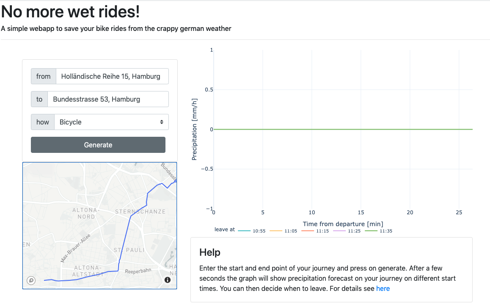

# No More Wet Rides! ☔

**Plan your bike rides and walks to avoid the rain.**



Stuck underneath a tree on a rainy day wondering when it's safe to head home? This app analyzes real-time precipitation forecasts along your route and suggests the optimal departure time to minimize exposure to rain.

**Coverage:** Germany and neighboring countries (RADOLAN data coverage area)

## Features

- 🚴 **Route-based forecasting** - Get rain predictions along your entire journey
- 📍 **Point forecasting** - Check rain forecast for a specific location
- ⏱️ **Departure time suggestions** - Find the best time to leave in 5-minute intervals
- 🗺️ **Interactive map** - Visualize your route with rain intensity overlay
- 📊 **Time-series charts** - See precipitation forecast throughout your trip
- 🚶 **Multiple transport modes** - Cycling, walking, or driving routes

## How It Works

1. **Geocoding & Routing**: Enter start and end addresses → Mapbox API resolves coordinates and calculates the optimal route with timing
2. **Weather Data**: App downloads latest RADOLAN forecast from DWD (Deutscher Wetterdienst) opendata server
3. **Data Processing**: RADOLAN files are parsed using adapted wradlib libraries, converted to mm/h rain rates
4. **Route Analysis**: Rain intensity is interpolated along your route based on arrival times at each point
5. **Visualization**: Results shown as interactive Plotly time-series and Leaflet map

### Data Sources

- **Weather**: [RADOLAN WN](https://www.dwd.de/DE/leistungen/radolan/radolan.html) forecast product from DWD
- **Geocoding & Routing**: [Mapbox API](https://www.mapbox.com/)
- **Updates**: Every 5 minutes, ~2 hour forecast horizon

## Installation

### Prerequisites

- Python 3.8+
- Mapbox API key ([get one here](https://account.mapbox.com/))

### Setup

```bash
# Clone the repository
git clone <repository-url>
cd no-more-wet-rides-new

# Install dependencies
pip install -r requirements.txt

# Set environment variables
export MAPBOX_KEY="your_mapbox_api_key_here"

# Optional: OpenMeteo API key for alternative weather data
export OPENMETEO_KEY="your_openmeteo_key_here"
```

### Running the App

```bash
# Start the development server
gunicorn app:server

# The app will be available at http://localhost:8000/nmwr/
```

For production deployment, configure gunicorn with appropriate workers:
```bash
gunicorn app:server --workers 4 --bind 0.0.0.0:8000
```

## API Endpoints

The application provides JSON endpoints for programmatic access:

### Route Forecast
```
GET /nmwr/ridequery?from=ADDRESS_START&to=ADDRESS_END
```

**Example:**
```bash
curl "http://localhost:8000/nmwr/ridequery?from=Holländische%20Reihe%2015,%20Hamburg&to=Bundesstrasse%2053%20Hamburg"
```

### Point Forecast
```
GET /nmwr/pointquery?address=ADDRESS
```

### Point Summary
```
GET /nmwr/pointsummary?address=ADDRESS
```

Returns summarized rain predictions at intervals.

## Project Structure

```
no-more-wet-rides-new/
├── app.py                  # Gunicorn entry point
├── main.py                 # Dash app initialization, global callbacks
├── endpoints.py            # JSON API endpoints
├── pages/
│   ├── ride/              # Route-based forecasting page
│   └── point/             # Point-based forecasting page
├── components/            # Reusable UI components
├── utils/
│   ├── radolan.py        # RADOLAN data parser
│   ├── utils.py          # Core logic (geocoding, routing, rain calc)
│   ├── settings.py       # Configuration and constants
│   └── openmeteo_api.py  # Alternative weather API
├── assets/                # Static files (CSS, images)
└── radolan_grid.pickle    # Pre-computed RADOLAN grid coordinates
```

## Configuration

Key settings in `utils/settings.py`:

- `URL_BASE_PATHNAME`: Base path for the app (default: `/nmwr/`)
- `CACHE_DIR`: Cache directory location (default: `/var/cache/nmwr/`)
- `RADAR_URL`: DWD RADOLAN data source URL
- `shifts`: Time offset intervals for departure suggestions

### Caching

Flask-Caching is used extensively with 15-minute timeouts to avoid repeated API calls and RADOLAN downloads. Cache directory is cleared on app initialization.

## Limitations

- **Geographic Coverage**: RADOLAN data only covers Germany and neighboring countries (Austria, Switzerland, France, Netherlands, Belgium, Poland, Czech Republic, Denmark)
- **Forecast Horizon**: ~2 hours ahead
- **Geocoding**: Very small neighborhoods not in Mapbox's database may not be found - use nearby streets or postal codes instead

## Technologies

- **Frontend**: Dash, Dash Bootstrap Components, Dash Mantine Components, Dash Leaflet
- **Data Processing**: Pandas, NumPy, scikit-learn
- **Visualization**: Plotly
- **Backend**: Flask, Gunicorn
- **Weather Data**: RADOLAN (via adapted wradlib code)
- **Maps & Routing**: Mapbox API

## Credits

RADOLAN data parsing adapted from [wradlib](https://github.com/wradlib/wradlib).

